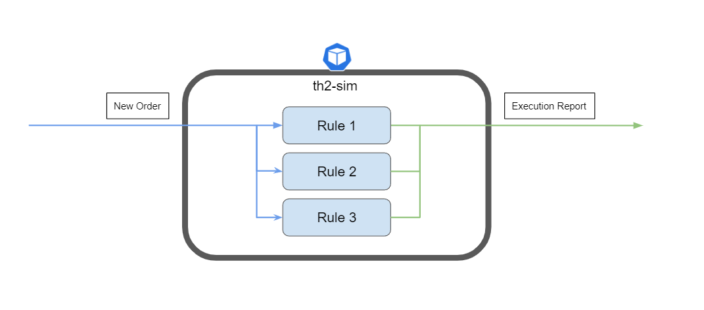
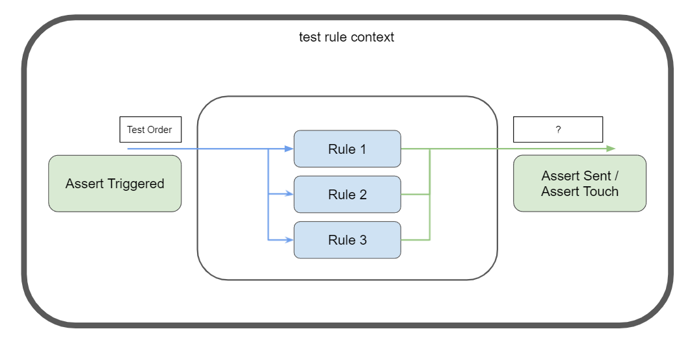
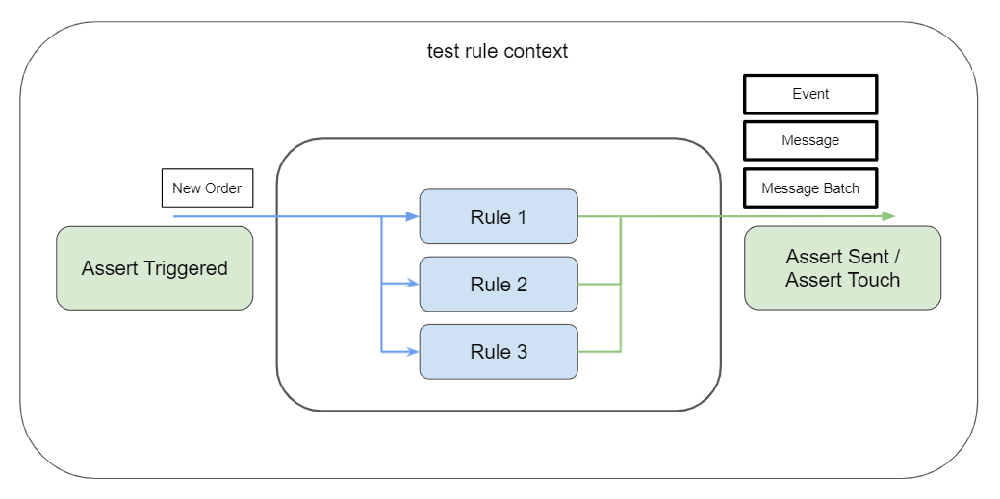

# Simulator core


## Description
The Simulator is a service used for simulate different logics.
All the logic is contained inside Rule. 
You can turn on/off rules for one connection or for different connections.
This project is java framework, so it is possible to create a custom Simulator 
## Interfaces
### ISimulator
The main interface of simulator, which contains the logic for managing rules and handle messages 
### ISimulatorServer
The interface used for managing gRPC server
### ISimulatorPart
The interface used for gRPC services to create Rules
### IRuleContext
The interface used for sending rules from IRule
## Triggering rule without income message
You can trigger a rule without an income message if you call the gRPC request ``touchRule``. 
You can transfer arguments to rule with it.
In a rule, you should override the method with the name ``touch``, which will call on triggering.
## Settings
The simulator using schema api for settings. \
Requirements: ``rabbitMq.json``, ``mq.json``, ``grpc.json`` (server only), ``custom.json`` (optional) 
#### Pins in MessageRouter
Simulator subscribe message batches from pins with the attributes: ``first``, ``subscribe``, ``parsed`` \
Simulator sends message group to pins with the attributes ``second``, ``publish`` \
_From **6.0.0** need to define messageFlow attribute, "default" as default, all incoming messages will be filtered to those messageFlows


*Example:*
```json
{
  "queues": {
    "subscribe1":{
      "name": "subscribe1_name",
      "queue": "subscribe1_queue",
      "exchange": "subscribe1_exchange",
      "attributes": ["first", "subscribe", "parsed", "default"]
    },
    "subscribe2":{
      "name": "subscribe2_name",
      "queue": "subscribe1_queue",
      "exchange": "subscribe1_exchange",
      "attributes": ["first", "subscribe", "parsed", "nondefault"]
    },
    "send1": {
      "name": "send1_name",
      "queue": "send1_queue",
      "exchange": "send1_exchange",
      "attributes": ["second", "publish", "default"]
    },
    "send2": {
      "name": "send2_name",
      "queue": "send2_queue",
      "exchange": "send2_exchange",
      "attributes": ["second", "publish", "nondefault"]
    }
  }
}
```

#### messageFlows
Simulator subscribe rules to messageFlow attribute in pins, default value  for rule is "default", all pins need to be filled with this attribute or custom one.
Pins with messageFlow attributes works only with related rules (with same value in RuleConfiguration object).
Message-flow doesn't affect messages, messageFlow is only used to be like a filter to let user manage flows of the messages. As example task: split some rules between two namespaces.
To use those related attributes need: 
1. Fill rule configuration
2. Set message-flow as attribute in pin

```yaml
pins:
    - name: subscribe1
      connection-type: mq
      attributes:
        - first
        - subscribe
        - parsed
        - example_message_flow  <-------
```

```kotlin
ServiceUtils.addRule(AnyRule(), RuleConfiguraion().apply { 
    sessionAlias = "non_required_alias" 
    messageFlow = "example_message_flow"
}, ... )
```

#### Custom configuration
It contains the settings for Simulator \
The field `strategyDefaultRules` can take the values `ON_ADD` or `ON_TRIGGER`. 
The default value is set to `ON_TRIGGER`.
If you set the value to `ON_ADD`, the default rules will be disabled if an user adds non-default rule.
If you set the value to `ON_TRIGGER`, the default rules will be disabled if non-default rules will be triggered on the same message. \
*Example:*

```json
{
  "strategyDefaultRules": "ON_ADD",
  "defaultRules": [
    {
      "methodName": "createRuleFIX",
      "enable": false,
      "settings": {
        "fields": {
          "ClOrdID": {
            "simple_value": "order_id"
          }
        },
        "connection_id": {
          "session_alias": "fix-client"
        }
      }
    }
  ]
}
```

### Custom Resources for infra-mgr
```ymal
apiVersion: th2.exactpro.com/v1
kind: Th2GenericBox
spec:
  type: th2-sim
  custom-config:
    defaultRules:
      - methodName: createDemoRule
        enable: true
        settings:
          fields:
            ClOrdID: 
              simple_value: order_id
          connection_id:
            session_alias: fix-client
  pins:
    - name: subscribe1
      connection-type: mq
      attributes:
        - first
        - subscribe
        - parsed
        - default
    - name: subscribe2
      connection-type: mq
      attributes:
        - first
        - subscribe
        - parsed
        - nondefault
    - name: send1
      connection-type: mq
      attributes:
        - second
        - publish
        - default
      filters:
        - metadata:
            - field-name: session_alias
              expected-value: some_alias_first
              operation: EQUAL
    - name: send2
      connection-type: mq
      attributes:
        - second
        - publish
        - nondefault
      filters:
        - metadata:
            - field-name: session_alias
              expected-value: some_alias_second
              operation: EQUAL
```

# Test toolkit 
**This information is valid for simulator core version 3.9.0 and newer!**



First, sim is working with external orders. All orders that coming from outside processing by rule’s logic have or don't 
have answered that comes out of them as result. Each rule can define is it target order or not. 
Tests are directed to check result of those rules not to check behavior inside them. 
For each test rule is black box.



For assertion of rule’s trigger test api have methods assertTriggered(Message) and 
assertNotTriggered(Message). Both methods will check rule’s result of checkTrigger() method. 
After assertion those methods will call handle to continue testing.



Result of handle can be Message, MessageBatch and Event. 
Those result will be tested in order one by one. 
You can check those by method assertSent (Type) {…}.

* assertTriggered(Message) / assertNotTriggered(Message) - method to check result of rule’s trigger
* handle(Message)  - method to check result of rule’s handle method
* assertAndHandle(Message) - method to check result of rule’s trigger and calls handle after it
* touch(Map<String, String>) - method to check result of rule’s touch method
* assertSent(Message) - method to check last message sent
* assertSent(RawMessage) - method to check last raw message sent
* assertSent(MessageBatch) - method to check last message batch sent
* assertSent(MessageGroup) - method to check last message group sent
* assertSent(Event) - method to check last event sent
* assertNothingSent() - method to assert nothing was sent from rule

#### Example of usage:

```
testRule {
    val rule = SomeRule(args)

    rule.assertTriggered(test_message)
    rule.handle(test_message)
    // Can be just assertHandle instad of those two methods
    
    assertSent(Message::class.java) { output_message ->
        Assertions.assertEquals( “expected message type”, output_message.messageType)
    }

    assertSent(MessageBath::class.java / Message::class.java / Event::class.java / MessageGroup::class.java / RawMessage::class.java) { … }

    assertNothingSent()
}
```

**Line 1 - 15**: block of test. After this block all results will be cleared to unmistakably handle new block;

**Line 2**: example of rule that need to be tested;

**Line 8** - 10: method with type argument Message, this means type of expected output result must be Message and only Message. After assertations inside of block result message will be cleared and next assert method will get next result by order. If there no results assertation will fail. If there instead of Message another type of result, assertation will fail;

**Line 12**: example of method after first test, there can be more until end of result queue;

**Line 14**: method to check is there no result in queue;

## Changelog

### 6.0.0
+ Aliases removed from attributes for common filtering support
+ Alias attribute switched to messageFlow attribute
+ Execution pool for rule tasks implemented

### 5.2.1
+ Removed duplicate rule-removal event

### 5.2.0
+ Toolkit logic updated: all errors will be thrown as unexpected

### 5.1.0
Fixed bug of not throwing assertion error

### 5.0.0
+ Send event on rule message handling error
+ Updated text of rule creation event
+ Send event on default rule creation error

### 4.1.0
+ Updated rule context, supports message groups and raw message as output of rule

### 4.0.0
+ Update `common-j` to 3.31.6
+ Removed session-alias as argument for publish pins. Please use filter instead

### 3.9.0
+ Added testFixtures as test utils for rules

### 3.8.0
+ Update `common-j` to 3.21.2

### v3.7.0
+ Added ability to schedule execution of arbitrary actions via `IRuleContext.execute` methods

### v3.6.0
+ Added `IRuleContext.removeRule()` method which allows a rule to remove itself